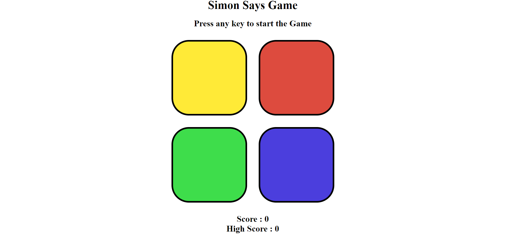

# Simon Says Game

This is a Simon Says game implemented using HTML, CSS, and JavaScript.

## Description

Simon Says is a classic memory game where the game shows a sequence of colors, and the player must repeat that sequence by clicking on the colored boxes. The sequence gets longer as the game progresses, challenging the player's memory.

## Features

- Start the game by pressing any key or clicking on any button.
- Each level increases the sequence length.
- Track your score and high score.
- Responsive design with colored boxes that flash when clicked or as part of the game sequence.

## Preview

## Getting Started

To run the game locally:

1. Clone this repository.
2. Open `index.html` in your web browser.

## How to Play

- Press any key or click any button to start the game.
- Watch the sequence of colors shown by the game.
- Repeat the sequence by clicking on the colored boxes.
- Each correct sequence increases your score.
- Game over if you make a mistake in the sequence.

## Credits

- Developed by Om prakash Adhikari